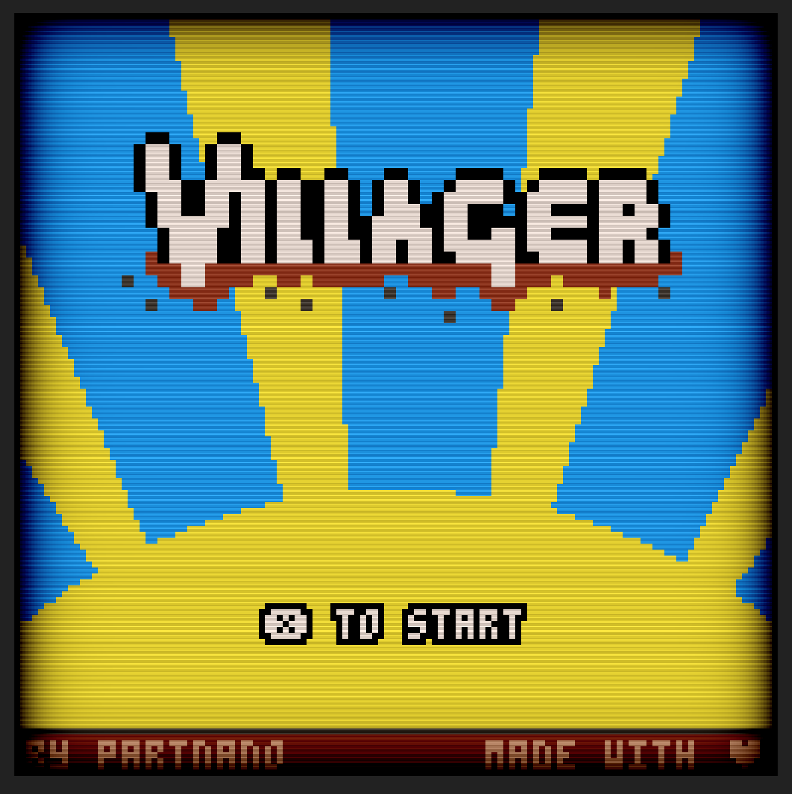

# Pico-8 Post Processing

[Live Example](https://greggman.github.io/pico-8-post-processing/nano-villager_html/).



[Pico-8](https://www.lexaloffle.com/pico-8.php) exports to HTML via
`export somename.html`

Add this script to the top of that page as in

```html
<script src="https://greggman.github.io/pico-8-post-processing/pico-8-post-processing.js"></script>
```

Then below it add your GLSL post processing filter.

```html
<script>
pico8Filter.setFilter({
  fragmentShader: `
    void mainImage( out vec4 fragColor, in vec2 fragCoord )
    {
        vec2 uv = fragCoord / iResolution.xy;
        fragColor = texture2D(iChannel0, uv);
    }
  `,
  width: 128,
  height: 128,
});
</script>
```

Filters are based on the same uniforms as [Shadertoy](https://shadertoy.com). In particular you're
expected to write a GLSL shader function like this

```glsl
void mainImage( out vec4 fragColor, in vec2 fragCoord )
{
    vec2 uv = fragCoord / iResolution.xy;
    fragColor = texture2D(iChannel0, uv);
}
```

with access to [the same inputs as Shadertoy](https://www.shadertoy.com/howto). In particular

## Uniforms

* `uniform vec3 iResolution;`

  The resolution of the canvas or in other words the output resolution (see [options](#options) below).

* `uniform float iTime;`

  The time in seconds since the filter was set

* `uniform float iTimeDelta;`

  The time in seconds since the previous frame

* `uniform float iFrame;`

  The frame count since the filter was set

* `uniform float iChannelTime[4];`

  The same as `iTime`

* `uniform vec4 iMouse;`

   `xy` are the mouse position in canvas coordinates, z is the mouse button.
   note: `xy` are only updated when the button is pressed.

* `uniform vec4 iDate;`

  The date in seconds since January 1st 1970

* `uniform vec3 iChannelResolution[4];`

  `[0]` is the size of the input texture which is always (128x128) Pico-8

* `uniform sampler2D iChannel0;`

  The Pico-8 texture

* `uniform sampler2D iChannel1;` (and `2` and `3`)

  User supplied textures (see [options](#options) below).

## Options

Call `pico8Filter.setFilter` to set a new filter.

* `fragmentShader` (string)

  The `mainImage` GLSL function for your filter

* `width`, `height` (number)

  The the resolution to make the canvas. Pico-8's normal canvas
  size is 128x128 but if you want to post process you probably want
  more output pixels than input pixels. The default is 128x128
  Setting a dimension to a negative number means to take that canvas's
  display times that amount. In other words,

  ```
  width: 128,   // make the canvas's resolution 128 pixels wide
  ```

  vs

  ```
  width: -2,    // make the canvas's resolution double its display size 
  ```

* `iChannel0`, `iChannel1`, `iChannel2`, `iChannel3` (object)

  These are user supplied textures, they have 4 options:

  * `filter` (string)

     like Shadertoy can be `nearest` (default), `linear` or `mipmap`

  * `wrap` (string)

     like Shadertoy can be `repeat` or `clamp` (default)

  * `vFlip` (bool)

     true or false to flip the texture. 

  * `src` (HTMLElement, string, ImageData-ish)

     If you pass it a string it will assume it's a URL for an image and 
     load it

     If you pass an HTMLElement like `Image` it will use it immediately

     If you pass it a JavaScript object with something like

     ```js
     {
       width: 128,
       height: 128,
       data: new Uint8Array(128 * 128 * 4),
     }
     ```

     It will upload that data as RGBA/UNSIGNED_BYTE data

  `iChannel0` is always the texture of the game from pico8 so you can
  only use the `filter`, `wrap` and `vFlip` settings. You'll probably
  want to set `vFlip` to `true`

## Licence

MIT

